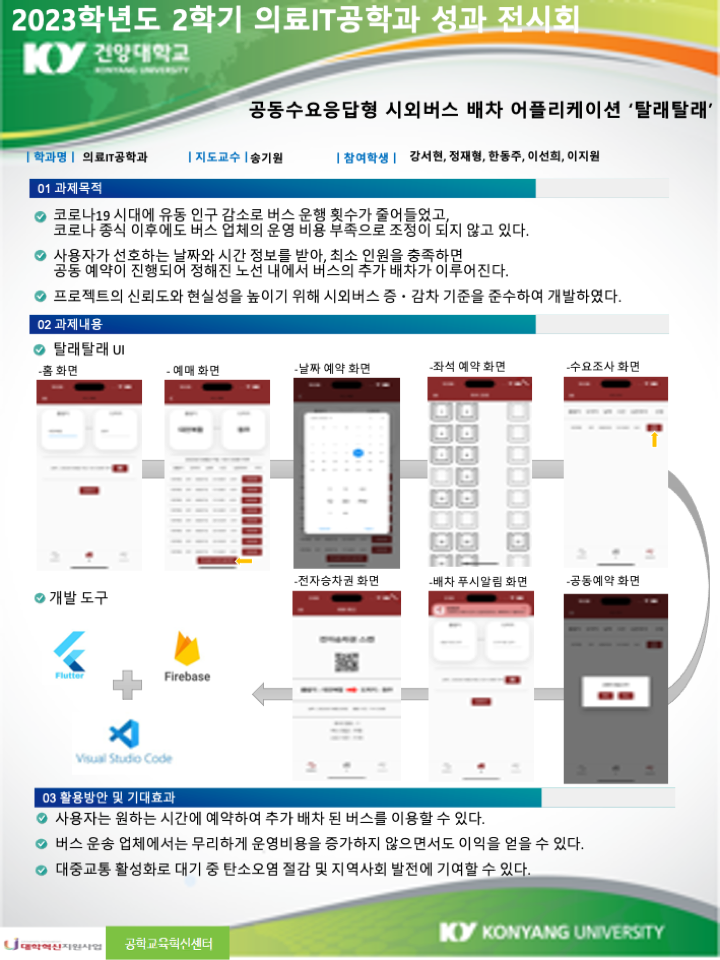

# TaleTale
## 공동수요응답형 시외버스 배차 어플리케이션
사용자가 선호하는 날짜와 시간 정보를 받아, 최소 인원을 충족하면 공동 예약이 진행되어 정해진 노선 내에서 버스의 추가 배차가 이루어지는 서비스입니다. 
코로나로 인한 시외버스 배차시간 감축으로 인해 사용자들의 불편함을 해소하고자 제작하였습니다.

🔗 [클릭하세요](./saso 문서.zip)

</a>
</a>
</a>

